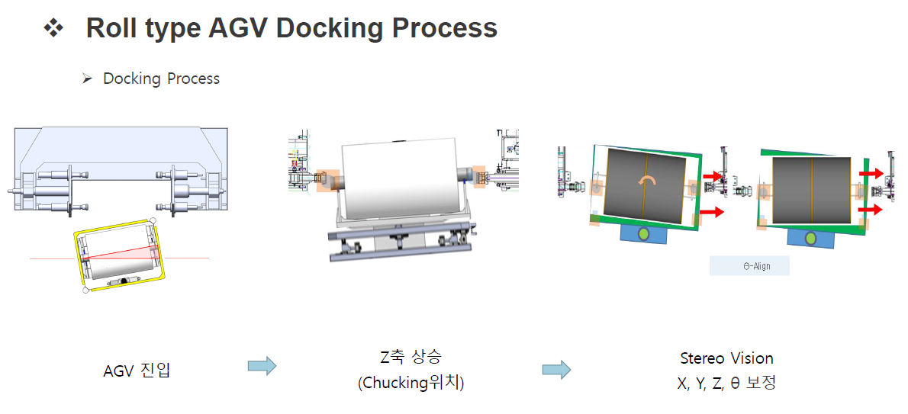
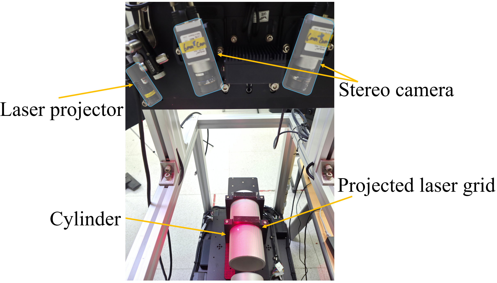
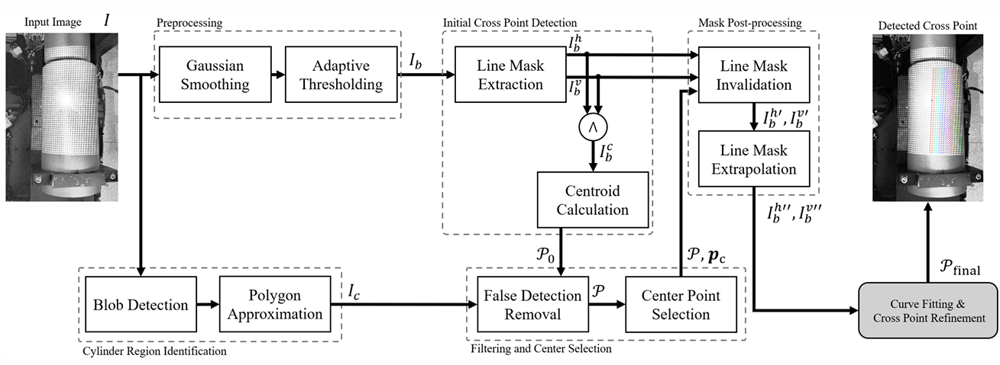
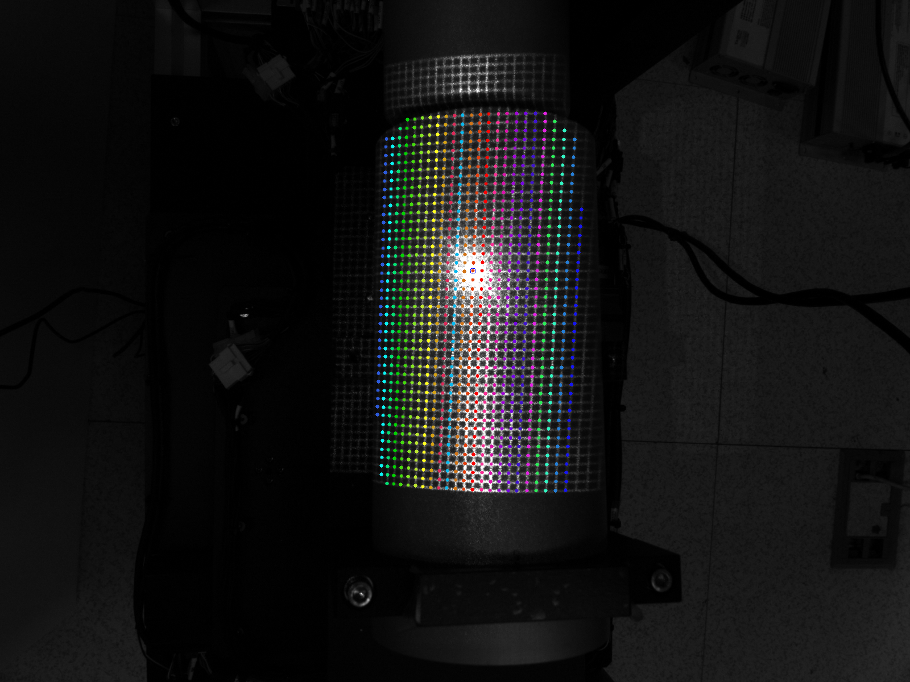
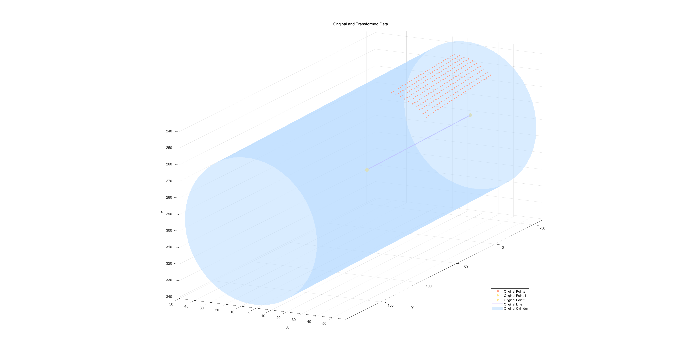
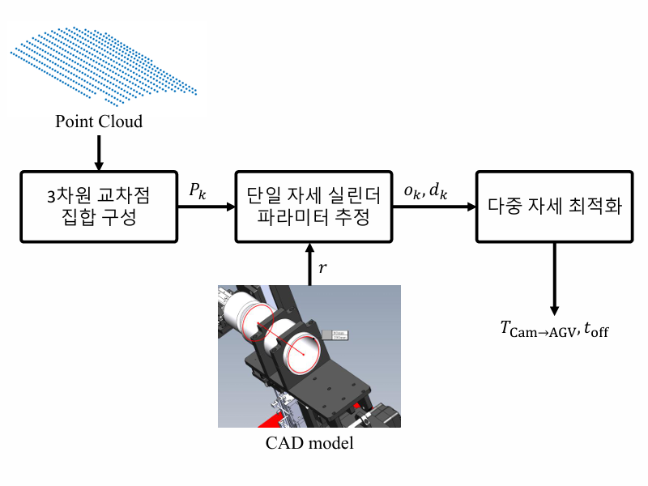
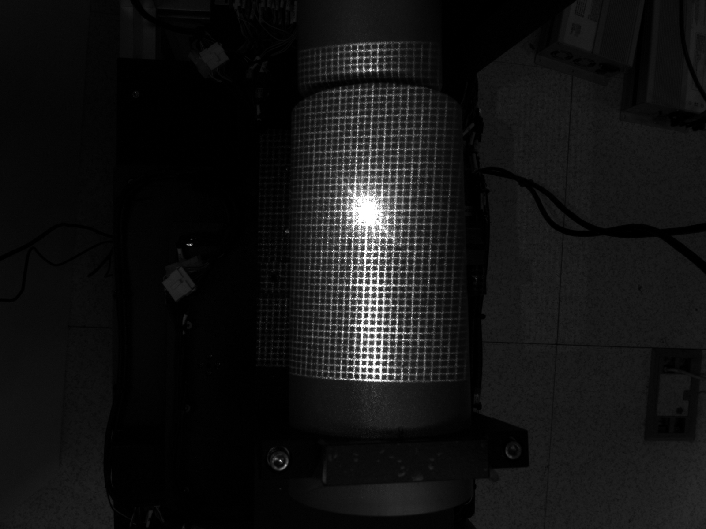

# AGV Pose Estimation using Laser Grid

프로젝트 기간 | 2024.09 - 2025.02

## Overview

본 프로젝트의 목표는 스테레오 비전과 레이저 그리드 패턴을 활용하여 텍스처가 없는 실린더 객체의 3차원 위치 및 자세를 추정하는 것입니다.

기존 산업 환경에서는 QR 코드 또는 AR 마커를 부착하여 객체의 자세를 추정하였으나, 본 프로젝트에서는 마커 없이도 자세 추정이 가능한 비전 기반 파이프라인을 설계하였습니다.

본 프로젝트에서 초기 스테레오 카메라 캘리브레이션부터 데이터 촬영, 레이저 그리드 교차점 검출, 스테레오 기반 3차원 복원, 실린더 모델 피팅, 좌표계 변환을 통한 자세 추정까지 전체 파이프라인을 직접 수행하였습니다.

---

## Problem Definition

AGV 시스템에서는 롤 형태의 실린더를 장비 축과 정밀하게 정렬해야 합니다.

  

그러나 다음과 같은 문제가 존재합니다.

* 실린더는 단일 색상이며 텍스처가 없어 일반적인 특징점 기반 매칭 기법을 적용하기 어렵습니다.
* 기존 방식은 QR 코드 또는 마커 부착이 필요하여 유지보수 비용과 오염 문제가 발생합니다.
* 레이저 그리드를 투사하더라도, 레이저 프로젝터 중심에서 형성되는 중앙 광점은 다른 선보다 밝기가 높아 주변 교차점 정보를 훼손합니다.
* 실린더 표면의 곡률과 반사 특성으로 인해 동일한 레이저 선이라도 밝기와 두께가 일정하지 않습니다.

따라서 마커 없이도 안정적으로 교차점을 검출하고, 이를 기반으로 정밀한 자세 추정을 수행할 수 있는 알고리즘이 필요합니다.

---

## Key Idea

레이저 그리드를 실린더 표면에 투영하여 인위적인 특징점을 생성하고, 이를 교차점으로 정의하여 3차원 복원을 수행하였습니다.

특히 본 프로젝트에서는 단순히 교차점을 검출하는 것에 그치지 않고, 중앙 고광도 영역으로 인해 손실되는 주변 교차점 정보를 복원할 수 있도록 전체 파이프라인을 설계하였습니다.

### 교차점 (Intersection Point)

레이저 그리드에서 수평선과 수직선이 만나는 지점을 의미합니다.

* 실제 영상에서는 여러 픽셀로 퍼진 영역으로 나타납니다.
* 중심 위치를 계산하여 하나의 특징점으로 정의합니다.
* 이후 스테레오 매칭 및 3차원 복원의 핵심 입력 데이터로 사용됩니다.

---

## System Overview

  

* Stereo Camera
* Laser Grid Projector
* Cylinder Object
* AGV Alignment System

---

## Pipeline

  

---

## Method

### 1. Calibration and Data Acquisition

전체 파이프라인을 수행하기 위해 먼저 스테레오 카메라 캘리브레이션을 수행하였습니다.

캘리브레이션은 좌/우 카메라의 내부 파라미터와 외부 파라미터를 추정하여, 이후 삼각측량과 좌표 변환에 사용할 기준 정보를 얻기 위한 과정입니다.

#### 캘리브레이션이 필요한 이유

* 두 카메라의 상대 위치와 자세를 알아야 동일 점의 3차원 좌표를 복원할 수 있습니다.
* 렌즈 왜곡을 보정하지 않으면 교차점 좌표 자체가 왜곡되어 전체 자세 추정 정확도가 저하됩니다.
* 이후 계산되는 변환 행렬과 실린더 자세 추정 결과의 기준 좌표계를 정립하는 데 필요합니다.

캘리브레이션 이후에는 직접 실험 데이터를 촬영하였습니다.

#### 데이터 획득 과정에서 수행한 작업

* 레이저 그리드를 실린더 표면에 투영하였습니다.
* 스테레오 카메라로 좌/우 영상을 직접 촬영하였습니다.
* 중앙 광점의 과도한 밝기로 인해 주변 교차점 정보가 손상되는 문제를 확인하였습니다.
* 이를 완화하기 위해 카메라 노출을 낮춰 더 어두운 영상을 획득하고, 레이저 선과 배경의 대비가 더 크게 나타나도록 조정하였습니다.

즉, 본 프로젝트의 입력 데이터는 알고리즘 적용을 위해 주어진 것이 아니라, 문제 상황을 직접 관찰하고 촬영 조건을 조정하여 확보한 데이터입니다.

---

### 2. 교차점 검출 (Python)

  

Python(OpenCV)을 이용하여 교차점 검출 알고리즘을 구현하였습니다.

#### 사용 기술

* Python
* OpenCV
* NumPy
* Gaussian Filtering
* CLAHE
* Adaptive Thresholding
* Polynomial Curve Fitting

#### 처리 과정

1. Gaussian filtering을 통한 노이즈 제거
2. CLAHE를 이용한 국소 대비 향상
3. 적응형 이진화를 이용한 레이저 라인 분리
4. 수직/수평 라인 영역 분리
5. 교차 후보 영역 탐색
6. 교차점 중심 계산
7. 다항식 피팅 기반 서브픽셀 보정

#### 적용 이유

* 실린더 표면은 반사 및 밝기 불균일이 심하기 때문에 단순 threshold만으로는 교차점을 안정적으로 분리하기 어렵습니다.
* 레이저 선은 위치에 따라 두께와 밝기가 달라지므로, 전처리와 보정 과정을 함께 사용해야 합니다.
* 이후 스테레오 매칭과 삼각측량의 정확도를 확보하기 위해 서브픽셀 수준의 중심점 추정이 필요합니다.

---

### 3. Stereo Matching & 3D Reconstruction (MATLAB)

Python에서 검출한 교차점 좌표를 MATLAB으로 전달하여 3차원 복원을 수행합니다.

#### 사용 기술

* MATLAB
* Stereo Camera Calibration
* 3D Reconstruction
* Epipolar Geometry
* 3D Visualization

#### Triangulation 설명

두 카메라에서 동일한 점을 관측했을 때, 각 카메라에서 해당 점으로 향하는 광선의 교차 위치를 계산하여 3차원 좌표를 복원하는 방법입니다.

즉, 좌/우 이미지에서 검출한 동일 교차점 쌍을 이용하여 실제 공간상의 3차원 위치를 계산합니다.

#### MATLAB을 사용한 이유

* 스테레오 카메라 보정 결과를 직접 활용하기에 적합합니다.
* 기하 기반의 3차원 복원과 좌표계 변환을 안정적으로 수행할 수 있습니다.
* 이후 실린더 피팅, 최적화, 시각화까지 한 환경에서 연계하기에 적합합니다.

#### 구현 내용

* Python에서 추출한 교차점 좌표를 좌/우 영상 기준으로 정리하였습니다.
* 교차점의 행/열 관계를 유지하여 대응점을 구성하였습니다.
* 스테레오 카메라의 보정 정보를 사용해 각 교차점의 3차원 좌표를 계산하였습니다.
* 복원된 점군이 실제 실린더 곡면을 형성하는지 확인하기 위해 MATLAB에서 시각화 및 오차 분석을 함께 수행하였습니다.

---

### 4. Cylinder Fitting

  

복원된 3차원 점군을 기반으로 실린더 모델을 피팅하였습니다.

#### 추정 파라미터

* 중심축 방향 벡터
* 중심 위치
* 반지름

#### 왜 실린더 피팅이 필요한가

복원된 3차원 점군은 교차점들의 집합일 뿐이므로, 이를 바로 제어에 사용할 수는 없습니다.  
AGV 정렬에 필요한 것은 실린더의 중심축 방향과 위치이므로, 복원된 점군에 대해 기하학적 실린더 모델을 피팅하여 실린더의 자세를 파라미터 형태로 추정해야 합니다.

#### 구현 내용

* 복원된 3차원 교차점들이 하나의 실린더 곡면을 형성하도록 모델 피팅을 수행하였습니다.
* 점군으로부터 중심축과 반지름을 추정하였습니다.
* 복원 결과를 3차원 시각화하여 점군과 피팅된 실린더의 정합성을 확인하였습니다.

---

### 5. Pose Estimation (변환 행렬 계산)

  

#### 변환 행렬

변환 행렬은 서로 다른 좌표계 간의 위치 및 방향 관계를 나타내는 행렬입니다.

본 프로젝트에서는 카메라 좌표계에서 복원한 실린더 정보를 AGV 좌표계로 변환하기 위해 사용하였습니다.

일반적으로 변환 행렬은 다음 두 요소로 구성됩니다.

* 회전 행렬 R
* 이동 벡터 t

즉, 카메라 기준으로 측정된 좌표를 실제 장비 제어 기준 좌표로 옮기는 역할을 합니다.

#### 변환 행렬이 필요한 이유

* 비전 시스템은 카메라 좌표계 기준으로 3차원 점을 복원합니다.
* AGV 제어는 장비 또는 AGV 좌표계 기준으로 동작합니다.
* 따라서 카메라에서 얻은 결과를 실제 제어에 사용하려면 좌표계 변환이 필수적입니다.

#### 사용 기술

* MATLAB
* Nonlinear Optimization
* Coordinate Transformation
* 3D Visualization

#### 구현 내용

* 다중 자세 데이터 기반으로 변환 행렬을 추정하였습니다.
* 비선형 최적화를 통해 파라미터를 보정하였습니다.
* 최종적으로 복원된 실린더를 영상에 재투영하여 실제 정렬 결과와 비교하였습니다.

즉, 이 단계의 핵심은 3차원 복원 결과를 실제 장비 제어에 연결 가능한 형태로 변환한 것입니다.

---

## Troubleshooting

### 중앙 고광도 영역으로 인한 교차점 손실

  

#### 문제 상황

레이저 그리드를 투사하면 레이저 프로젝터 중심에서 형성되는 중앙 광점의 밝기가 주변 선들보다 훨씬 높게 나타났습니다.  
이로 인해 중앙 주변의 여러 교차점이 하나의 강한 광점으로 뭉쳐 보였고, 실제로는 존재하는 교차점들의 위치 정보를 직접 검출하기 어려웠습니다.

#### 해결 방법

먼저 카메라 노출을 낮추어 더 어두운 영상을 촬영함으로써, 중앙 광점의 포화를 완화하고 레이저 선과 배경 간 대비를 더 크게 확보하였습니다.  
그러나 노출을 낮춘 이후에도 중앙 주변 일부 교차점은 하나의 광점으로 합쳐지는 문제가 남아 있었습니다.

이를 해결하기 위해, 주변에서 정상적으로 검출된 교차점들의 행/열 구조와 위치 관계를 이용하여 손실된 교차점의 위치를 보간하는 방법을 적용하였습니다.  
즉, 중앙 주변의 점을 단순히 제거하지 않고, 전체 그리드의 구조적 일관성을 이용해 복원 가능하도록 설계하였습니다.

#### 결과

중앙 고광도 영역으로 인해 누락되던 교차점 정보를 보완할 수 있었고, 전체 교차점 집합의 연속성과 정합성을 유지할 수 있었습니다.

---

## Results

### 교차점 검출 결과

* 평균 재투영 오차: **0.456 px**
* 기존 Gaussian 기반 방법 대비 약 **65.2% 개선**
* Hessian 기반 보정 대비 약 **34.5% 성능 향상**

교차점 검출 정확도는 이후 스테레오 매칭과 3차원 복원의 입력 품질을 결정하므로, 본 결과는 전체 자세 추정 성능의 기반이 됩니다.

중앙 광점으로 인해 손실되던 주변 교차점 정보까지 보완하여, 실제로 안정적인 교차점 집합을 구성할 수 있었습니다.

---

### 스테레오 교차점 매칭

* 좌/우 영상 간 교차점 대응 관계를 유지하였습니다.
* 동일한 grid 구조를 기반으로 각 교차점의 위치 식별이 가능하도록 구성하였습니다.
* 곡률 변화와 조명 변화가 존재하는 조건에서도 일관된 대응점 구성이 가능하였습니다.

---

### 3D 점군 복원 결과

* 교차점 기반 3D point cloud를 생성하였습니다.
* 복원된 점군이 실린더 곡면 형태를 안정적으로 형성함을 확인하였습니다.
* 전체 데이터셋 기준 실린더 표면 거리 기반 평균 오차는 **0.114 mm** 수준으로 나타났습니다.

이는 검출된 교차점들이 단일 실린더 곡면 위에 밀착되어 존재함을 의미하며, 3차원 복원의 기하학적 일관성이 확보되었음을 보여줍니다.

---

### 실린더 피팅 및 재투영

* 복원된 실린더 모델을 실제 영상에 재투영하여 정합성을 확인하였습니다.
* 단일 자세 기반 피팅뿐 아니라 다중 자세 기반 최적화를 수행하여 전역적 정합성을 확보하였습니다.
* 16개 자세 조합을 사용한 다중 자세 피팅에서 평균 각도 차이가 **0.2도 이하**임을 확인하였습니다.

이는 한 장면에 과적합된 결과가 아니라, 여러 자세 변화에 대해 일관되게 동작하는 모델을 구성했음을 의미합니다.

---

### 자세 추정 성능

* Pan 오차: **0.1347°**
* Tilt 오차: **0.0610°**
* 목표 기준인 **0.2° 이하**를 만족하였습니다.

또한 실험 데이터는 pan -4° ~ +4°, tilt -8° ~ +8° 범위에서 총 45조건, 3세트 반복 촬영으로 구성하였으며, 다양한 자세 변화 조건에서 안정적인 성능을 확인하였습니다.

### 결과 해석

* 0.456 px 수준의 교차점 검출 정확도는 스테레오 3차원 복원에 충분히 안정적인 입력 데이터를 제공합니다.
* 0.114 mm 수준의 실린더 표면 오차는 복원된 3차원 점군이 실제 실린더 모델과 잘 일치함을 보여줍니다.
* Pan/Tilt 오차가 모두 0.2° 이하로 유지되어 AGV 정렬 시스템의 목표 정확도를 만족합니다.
* 마커 없이도 실린더의 자세를 정밀하게 추정할 수 있어 기존 마커 기반 방식의 대안으로 활용할 수 있습니다.

---

## Tech Stack

### Python

* Python
* OpenCV
* NumPy

역할:

* 레이저 그리드 교차점 검출
* 이미지 전처리
* 고광도 영역 대응 및 교차점 보간
* 특징점 좌표 추출

### MATLAB

* MATLAB
* Stereo Camera Calibration
* 3D Reconstruction
* Nonlinear Optimization
* 3D Visualization

역할:

* 스테레오 카메라 보정 결과 활용
* 교차점 기반 3차원 좌표 복원
* 실린더 모델 피팅
* 카메라 좌표계와 AGV 좌표계 간 변환 행렬 계산
* 재투영 및 시각화

---

## My Contributions

본 프로젝트에서 전체 알고리즘 파이프라인을 직접 설계 및 구현하였습니다.

특히 다음 항목을 핵심적으로 수행하였습니다.

* 스테레오 카메라 캘리브레이션 수행 및 복원 기준 좌표계 구성
* 실험 데이터 직접 촬영 및 노출 조건 조정
* Python 기반 레이저 그리드 교차점 검출 알고리즘 구현
* 중앙 고광도 영역 대응 및 교차점 보간 로직 설계
* MATLAB 기반 3차원 복원 및 실린더 피팅 파이프라인 구축
* 카메라 좌표계와 AGV 좌표계 간 변환 행렬 추정
* 다중 자세 데이터 기반 자세 추정 성능 검증 및 시각화

---

## Conclusion

본 프로젝트는 텍스처가 없는 실린더 객체에 대해 마커 없이도 고정밀 자세 추정이 가능한 알고리즘을 제안합니다.

특히 레이저 프로젝터 중심의 고광도 문제로 인해 손실되는 교차점 정보를 촬영 조건 조정과 보간 방법으로 해결하였고, 이를 바탕으로 스테레오 기반 3차원 복원과 실린더 자세 추정을 안정적으로 수행하였습니다.

산업 환경에서 요구되는 정확도를 만족하며, 비전 기반 자동화 시스템에 적용 가능한 수준의 성능을 확보하였습니다.
