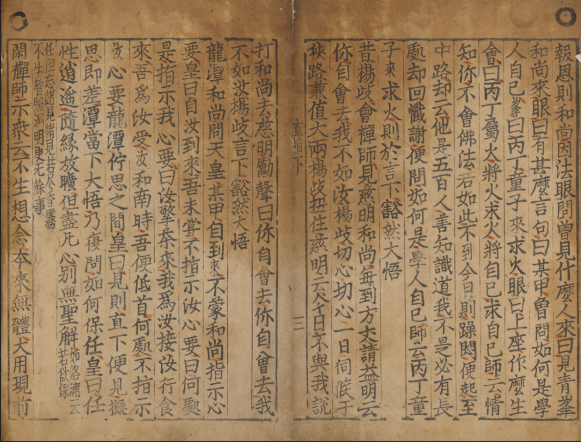
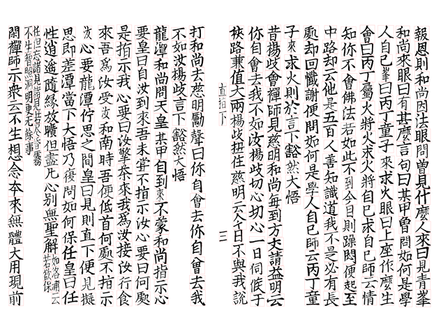
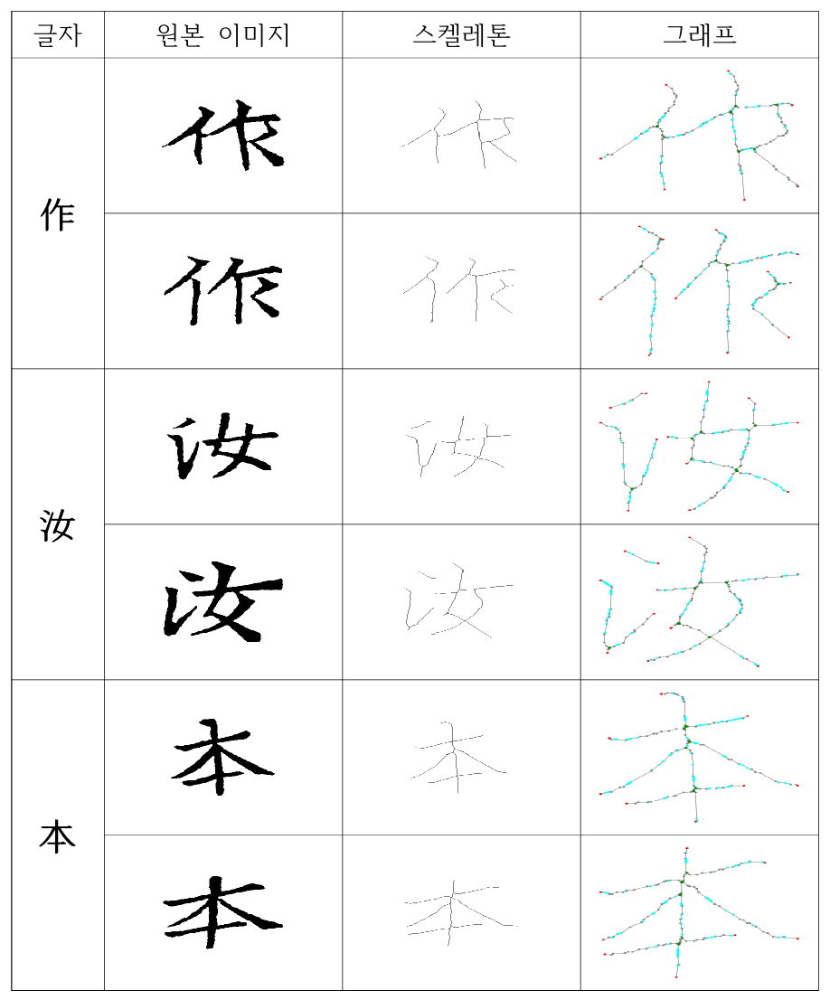
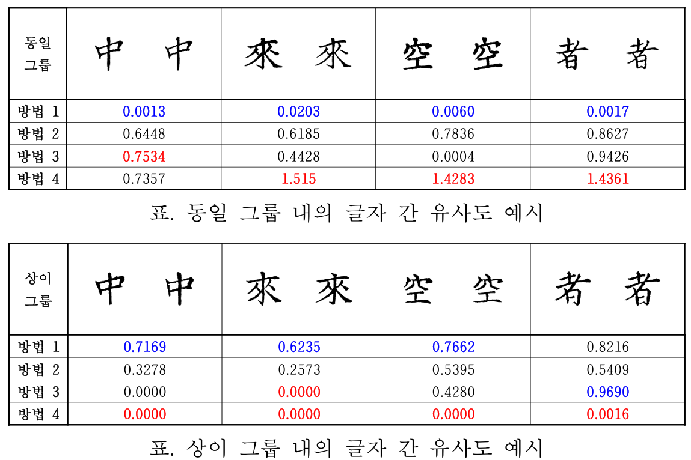
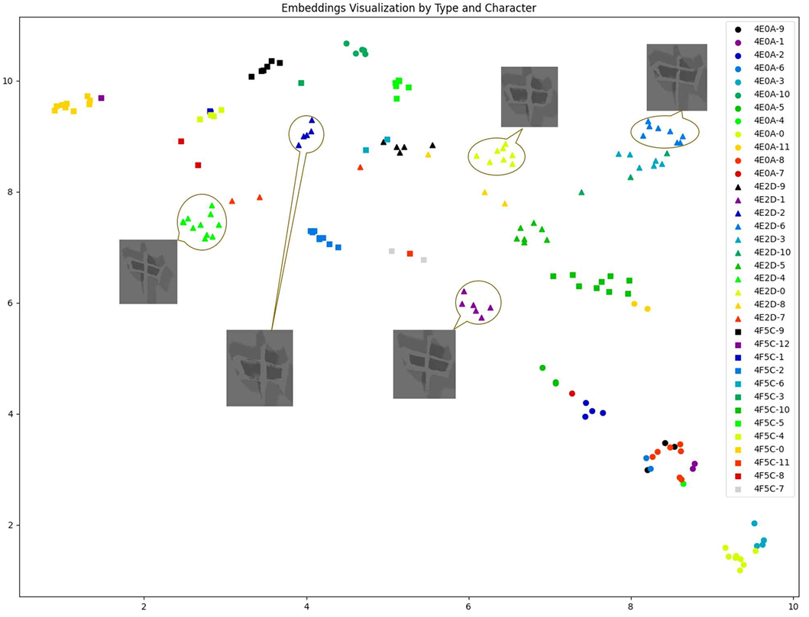
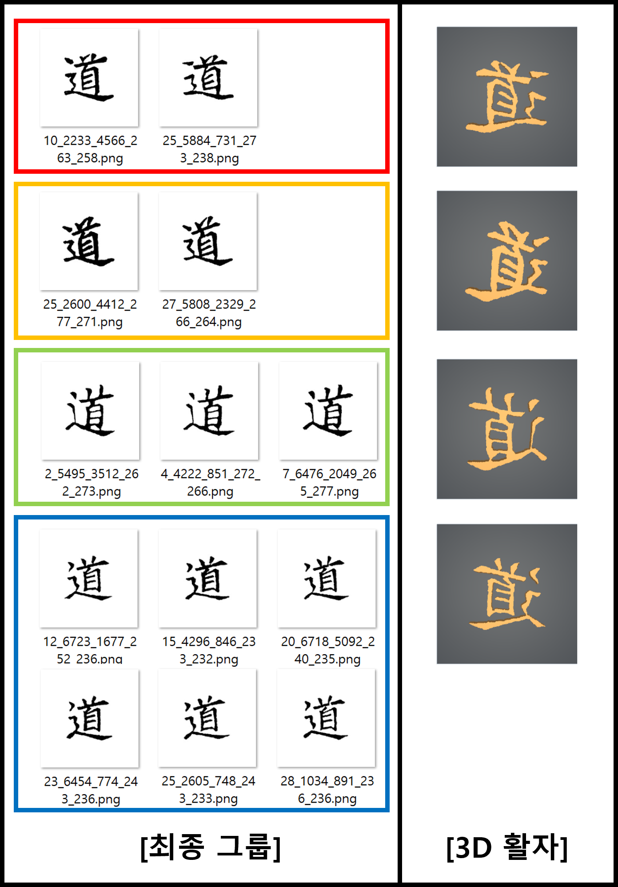

# 금속활자본을 이용한 금속활자의 과학적 분석 및 복원

프로젝트 기간 | 2022.12 - 2025.02

## 1. 프로젝트 개요

본 프로젝트는 금속활자본을 디지털 데이터로 구축하고, 인쇄된 글자들로부터 실제 사용된 금속활자의 형태와 개수를 추정하여, 최종적으로 금속활자의 형상을 복원하는 프로젝트입니다.
고인쇄물 글자 영상 추출, 동일 활자 판별, 군집화, 3차원 활자 복원으로 이어지는 디지털 분석 및 복원 파이프라인으로 구성됩니다. 

  

<em>직지심체요절 원본 스캔 이미지</em>

  

<em>고인쇄물 페이지 글자 영역 분할 결과, 동일 활자 판별 입력용 글자 영상 데이터</em>

---

## 2. 전체 수행 과정

### 전체 파이프라인

1. **금속활자본 스캔 및 데이터 구축**
2. **고인쇄물 글자 분할**
3. **동일 활자 판별 및 군집화**
4. **군집 결과 기반 3차원 활자 복원**

### 수행 범위

저는 다음 업무를 수행하였습니다.

* **금속활자본 스캔 및 데이터 라벨링**
* **TransUNet 기반 글자 분할 구조 개선**
* **GNN 기반 동일 활자 판별 및 군집화 파이프라인 설계**
* **Triplet Loss 기반 임베딩 학습**
* **동일 활자 군집 결과 기반 3차원 활자 복원**

프로젝트 전체는 디지털 영상 데이터 획득, 딥러닝 기반 글자 추출, 동일 활자 인쇄 글자 분류, 3차원 활자 복원으로 이어지는 구조로 수행되었습니다. 

---

## 3. 문제 상황

### 문제 1. 고인쇄물 노이즈

고인쇄물에는 다음과 같은 문제가 존재합니다.

* **변색**
* **찢어짐**
* **얼룩**
* **종이 결**
* **먹 번짐**
* **도장 자국**

이로 인해 **규칙 기반 방식만으로는 글자 영역과 배경을 안정적으로 분리하기 어렵습니다.** 고인쇄물 글자 추출은 다양한 노이즈 환경에 강건해야 하며, 이를 위해 딥러닝 기반 접근이 요구되었습니다. 

### 문제 2. 동일 활자 판별의 난점

동일 활자 판별은 일반적인 문자 분류와 다릅니다.

* 같은 한자라도 **서로 다른 금속활자**로 인쇄될 수 있음
* 같은 금속활자라도 **먹 번짐, 인쇄 압력, 정렬 오차**로 인해 다른 형태로 보일 수 있음
* 동일 글자 판별이 아니라 **동일 활자 판별**이 핵심 과제임

따라서 단순 픽셀 유사도보다, 인쇄 변형에 덜 민감한 구조적 비교 방법이 필요했습니다. 

### 문제 3. 부족한 프로젝트 초기 라벨

프로젝트 초기에는 다음 제약이 있었습니다.

* 동일 활자 여부에 대한 **정답 라벨 부족**
* 즉시 **지도학습 분류 모델 적용 곤란**
* 먼저 **유사한 데이터끼리 묶는 접근** 필요

이 때문에 초기 단계에서는 분류보다 **유사도 계산과 군집화**가 먼저 수행되어야 했습니다. 

### 문제 4. 미학습 데이터 일반화

실제 프로젝트 환경에서는 모든 활자 유형을 충분히 학습시킬 수 없습니다.

* **학습 데이터 외 새로운 활자**에도 적용 가능해야 함
* 동일 활자는 **가깝게**
* 다른 활자는 **멀게**
* **일반화 가능한 임베딩 공간** 필요

이 때문에 단순 클래스 분류보다 **유사도 기반 임베딩 학습**이 중요했습니다. 

---

## 4. 수행 업무

## 4.1 데이터 구축

### 수행 내용

* 금속활자본 원본 직접 스캔
* 후속 분석용 데이터 정리
* 데이터 라벨링 수행
* 학습 및 분석용 데이터셋 구성

### 의미

이 단계는 단순 수집 작업이 아니라, 후속 모델 학습과 검증에 사용되는 **입력 데이터 품질을 결정하는 기반 작업**입니다.

### 사용 기술

* **스캔 데이터 획득 및 정리**
* **데이터 라벨링**
* **분석용 데이터셋 구성**

직지심체요절 권하는 1,200dpi급 사진으로 확보하고, 자비도량참법집해·신편산학계몽·자휼전칙 등은 정밀 스캔으로 수집한 흐름으로 정리되어 있습니다. 

---

## 4.2 고인쇄물 글자 분할

### 문제 상황

고인쇄물은 잡음과 훼손이 심하여 다음과 같은 문제가 있습니다.

* 글자와 배경 경계 불명확
* 노이즈가 글자처럼 보이는 경우 발생
* 글자 추출 결과가 후속 동일 활자 판별 성능에 직접 영향

### 접근 방법

기존 **TransUNet 기반 구조**를 **Dual Swin TransUNet 기반 구조**로 전환하였습니다.

이렇게 한 이유는 다음과 같습니다.

* 더 넓은 문맥 정보를 활용할 수 있음
* 고인쇄물 특유의 불안정한 배경에 더 강건함
* 후속 단계 입력 품질을 안정화할 수 있음

또한 글자 영역 이진화뿐 아니라 **글자 위치 추정 결과를 이용한 개별 글자별 세그먼트 생성**까지 포함하는 파이프라인으로 구성하였습니다. 고해상도 입력에는 **overlap-tile 방식**을 적용해 타일 단위 추론 후 결합하는 방식으로 처리하였습니다. 

### 수행 내용

* 기존 분할 구조 분석
* **TransUNet → Dual Swin TransUNet 구조 전환**
* **글자 영상 생성 파이프라인 구성**
* **고해상도 이미지 대응 추론 방식 적용**

### 사용 기술

* **Python 기반 세그멘테이션 파이프라인 설계 및 적용**
* **TransUNet**
* **Dual Swin TransUNet**
* **글자 이진화 및 위치 추정 연계 처리**
* **Overlap-tile 기반 고해상도 추론 구성**

---

## 4.3 동일 활자 판별 및 군집화

### 문제 상황

동일 활자 판별에서는 다음 문제가 존재합니다.

* 같은 활자라도 **외형이 매번 조금씩 다름**
* 다른 활자라도 **매우 유사하게 보일 수 있음**
* 단순 픽셀 비교만으로는 안정적인 판별이 어려움

### 핵심 판단

저는 이 문제를 **이미지 비교 문제**가 아니라 **구조 기반 유사도 측정 문제**로 보았습니다.

그 이유는 다음과 같습니다.

* 먹 번짐은 **획 두께**를 흔듦
* 인쇄 편차는 **외곽 형태**를 흔듦
* **획의 연결 구조와 분기 패턴**은 상대적으로 더 안정적임

즉, **픽셀 자체보다 구조를 봐야 한다고 판단하였습니다.**

### 접근 방법

다음 순서로 파이프라인을 구성하였습니다.

1. **글자 영상 스켈레톤화**
2. **스켈레톤을 그래프로 변환**
3. **GNN 기반 특징 임베딩 학습**
4. **유사도 계산 및 군집화 수행**

  

<em>글자 영상 스켈레톤화 및 그래프 변환 과정, GNN 기반 구조 유사도 학습 입력 데이터</em>

### 사용 기술

* **Python 기반 구조 분석 파이프라인 구현**
* **Skeletonization**
* **Graph Construction**
* **Graph Neural Network**
* **구조 기반 유사도 학습 및 군집화**

GNN 기반 방법은 글자의 구조적 정보를 노드와 에지로 변환하여 학습하고, 동일 활자 식별에 필요한 특징벡터를 추출하는 방식으로 구성하였습니다. 

---

## 4.4 Python 기반 전처리 및 그래프 생성

### 목적

이 단계의 목적은 **글자 영상을 구조 정보를 보존하는 그래프 표현으로 변환**하여, GNN이 동일 활자 판별에 필요한 특징을 학습할 수 있도록 입력 데이터를 구성하는 것입니다.

### 알고리즘 흐름

#### 1 스켈레톤 기반 형상 단순화

입력 글자 영상을 이진화한 뒤, 획의 두께 정보를 제거하고 **획의 중심선만 남기는 스켈레톤화**를 수행하였습니다.
이 단계의 목적은 먹 번짐이나 인쇄 압력 차이로 인해 달라지는 외곽 두께 정보를 줄이고, 동일 활자 판별에 더 중요한 **획의 위상 구조와 연결 관계**를 남기는 것입니다. 코드에서도 이미지를 grayscale로 읽은 뒤 이진 영상으로 변환하고, `skeletonize`를 적용해 1픽셀 폭의 중심 뼈대를 생성하도록 구성되어 있습니다. 

#### 2 스켈레톤의 그래프 변환

스켈레톤 영상에서 foreground 픽셀 각각을 하나의 노드로 두고, **8-이웃으로 연결된 픽셀들 사이에 에지**를 생성하여 문자 형상을 그래프로 변환하였습니다.
이렇게 하면 원래의 문자 이미지는 단순 픽셀 배열이 아니라, **노드와 에지로 이루어진 구조 데이터**로 바뀌게 됩니다. 이 표현은 획이 어디서 시작되고, 어디서 분기되며, 어떤 경로로 연결되는지를 직접적으로 담을 수 있다는 장점이 있습니다. 

#### 3 구조적 특징점 라벨링

그래프가 생성된 이후에는 각 노드의 **연결 차수(degree)** 를 기준으로 구조적 역할을 부여하였습니다.

* 차수 1 노드: **end**
* 차수 3 이상 노드: **high_degree**
* 그 외 노드: **normal**

즉, 획의 끝점과 분기점을 먼저 구분하고, 이후 특징 계산과 그래프 축약의 기준점으로 사용하였습니다. 

#### 4 곡률 및 거리 기반 특징량 계산

끝점과 분기점 사이의 경로를 따라가면서, 중간 노드가 두 특징점을 잇는 직선에서 얼마나 벗어나는지를 계산하였습니다.
이 값을 이용해 **곡선 정도와 기하학적 편차**를 수치화하였고, 경로 안에서 편차가 큰 지점은 `curve` 계열 특징점으로 승격하였습니다. 또한 일반 노드에는 `Fdis` 값을 부여하였습니다.

여기서 `Fdis`는 특정 normal 노드가, 자신이 속한 특징점-특징점 경로의 기준 직선으로부터 얼마나 떨어져 있는지를 나타내는 **수직거리 기반 편차값**입니다.
즉, Fdis가 작을수록 해당 노드는 전체 획 구조에서 직선 경로에 가까운 일반 노드이고, Fdis가 클수록 구조적 굴곡이나 변형을 더 많이 반영하는 노드로 해석할 수 있습니다. 코드에서는 특징점 사이 최단 경로의 중간 normal 노드들에 대해 직선 기준 수직거리를 계산하여 `Fdis`로 저장하도록 구성하였습니다.

#### 5 그래프 크기 정규화

스켈레톤을 그대로 그래프로 바꾸면 노드 수가 지나치게 커져 학습 효율이 떨어질 수 있기 때문에, 특징점이 아닌 `normal` 노드 중에서 **Fdis 값이 작은 노드부터 순차적으로 제거**하였습니다.
이때 노드를 삭제하더라도 양옆 이웃 노드를 다시 연결하여 전체 획 연결성은 유지하도록 구성하였습니다. 결과적으로 끝점, 분기점, 곡선 변화점 같은 핵심 구조는 남기면서도, 전체 그래프를 고정된 최대 노드 수 수준으로 정규화하여 GNN 입력에 적합한 형태로 만들었습니다.

### 의미

이 전처리 단계는 다음 목적을 가집니다.

* **획 두께와 번짐의 영향을 줄인 구조 표현 확보**
* **문자 영상을 그래프 기반 특징 학습 문제로 변환**
* **동일 활자 판별에 유효한 구조 정보 보존**
* **GNN 입력용 데이터셋 자동 생성**

스켈레톤화와 그래프 변환은 글자 이미지를 단순화하여 중요한 뼈대만 남기고, 이를 노드와 에지 관계로 모델링하여 더 정밀한 구조 분석을 가능하게 합니다. 

### 사용 기술

* **Python 기반 이미지-그래프 변환 알고리즘 구현**
* **scikit-image**
* **NumPy**
* **NetworkX**
* **구조 특징량 계산 및 그래프 정규화**

---

## 4.5 GNN 기반 유사도 측정 및 방법 비교

### 제안 방법

동일 활자 판별을 위해 저는 **글자 영상 스켈레톤화 → 그래프 변환 → GNN 기반 특징 임베딩 추출**로 이어지는 방법을 설계하였습니다.

이 방법의 핵심은 다음과 같습니다.

* 글자 이미지를 그대로 비교하지 않고 **구조 표현으로 변환**
* 획의 연결 구조와 분기 형태를 보존한 **그래프 입력 구성**
* GNN이 **구조적 관계 자체를 임베딩**하도록 설계
* 라벨 부족 환경에서도 **유사도 기반 군집화와 연계 가능**

  

<em>글자 영상 스켈레톤화 및 그래프 변환 과정, GNN 기반 구조 유사도 학습 입력 데이터</em>

### 비교 대상

성능 검증을 위해 제안한 **GNN 기반 방법**을 기존 방법들과 함께 비교하였습니다.

여기서 비교에 사용한 **유사도**는 단순히 두 글자 영상 사이의 수치가 아니라,  
**사전에 구축한 GT 기준으로 같은 활자에서 나온 글자 쌍과 다른 활자에서 나온 글자 쌍에 대해 계산한 유사도**입니다.

- **동일 그룹**
  - 직접 분류를 통해 **같은 금속활자에서 인출된 것으로 판단한 글자 영상 쌍**
- **상이 그룹**
  - 직접 분류를 통해 **서로 다른 금속활자에서 인출된 것으로 판단한 글자 영상 쌍**

즉, 표의 값은 각 방법이 **같은 활자끼리는 얼마나 높게**, **다른 활자끼리는 얼마나 낮게** 유사도를 부여하는지를 비교한 결과입니다.

  

<em>유사도 측정 방법 1~4 비교 결과, 방법 4인 GNN 기반 구조 유사도의 정량 성능</em>

* **방법 1. IoU 기반 비교**

  * 정합 이후 **IoU(Intersection over Union)** 계산
  * 교집합 / 합집합 비율로 유사도 산출

* **방법 2. 가우시안 스무딩 기반 비교**

  * 스켈레톤 추출
  * **Gaussian smoothing**
  * **ICP 정합**
  * 획 두께 변화 영향을 줄인 뒤 유사도 계산

* **방법 3. CNN 기반 비교**

  * **ResNet50 특징벡터** 추출
  * Contrastive Loss 기반 임베딩 학습
  * 벡터 거리 기반 유사도 계산

* **방법 4. GNN 기반 비교**

  * 글자 영상 스켈레톤화
  * 그래프 변환
  * **GNN 기반 특징벡터** 추출
  * 구조적 유사도 기반 군집화 수행

### 비교 우위

제안한 **방법 4(GNN 기반 구조 유사도)** 는 다음 성능을 보였습니다.

* **전체 방법 중 가장 높은 동일 그룹 평균 유사도**
* **10개 글자 중 9개 글자에서 최고 평균 유사도**
* **동일 그룹 내부에서 상대적으로 안정적인 분포**
* **구조 정보 기반 동일 활자 판별 적합성 확인**

특히 방법 1은 획 두께 차이에 민감하고, 방법 2는 이미지 공간 기반 비교의 한계를 가지며, 방법 3은 상이 그룹 평균도 함께 높아 분리도가 충분히 안정적이지 않았습니다. 반면 방법 4는 구조 기반 표현을 사용하여 동일 그룹 유사도를 가장 높게 유지하였습니다. 유사도 비교는 최소 40개 이상 글자가 있는 한자 10개를 대상으로 수행되었고, 동일 그룹에서는 유사도 값이 클수록, 상이 그룹에서는 값이 작을수록 더 정확한 결과로 해석됩니다.

### 사용 기술

* **GNN 기반 유사도 측정 방법 설계**
* **구조 기반 특징 임베딩 학습**
* **IoU / Gaussian smoothing / CNN / GNN 비교 평가**
* **정량 지표 기반 성능 검증**
* **초기 후보군 군집화 적용**

---

## 4.6 Triplet Loss 기반 학습

### 문제 상황

초기 군집화만으로는 다음 한계가 있었습니다.

* 새로운 데이터에 대한 일반화 부족
* 임베딩 공간의 일관성 부족
* 추가 라벨 확보 이후 더 정교한 학습 필요

### 접근 방법

일부 동일 활자 라벨이 확보된 이후, **Triplet Loss 기반 metric learning**을 적용하였습니다.

이 방식의 목적은 다음과 같습니다.

* 같은 활자는 **가깝게**
* 다른 활자는 **멀게**
* **동일 활자 판별에 적합한 임베딩 공간 형성**

### 판단 근거

이 프로젝트에서는 특정 활자 ID 분류보다, **유사 활자가 자연스럽게 가까워지는 표현 공간 학습**이 더 중요하다고 판단하였습니다. 따라서 분류 loss보다 **Triplet Loss**가 더 적합하다고 보았습니다. Triplet Loss는 앵커, 동일 활자 positive, 다른 활자 negative를 사용해 동일 활자 거리는 줄이고 상이 활자 거리는 늘리도록 학습합니다.

  

<em>GNN 및 Triplet Loss 기반 임베딩 분포와 후속 복원 결과</em>

그 결과로, 

### 사용 기술

* **GNN 기반 metric learning**
* **Triplet Loss**
* **임베딩 공간 최적화**
* **미학습 데이터 일반화 평가**

---

## 4.7 3차원 활자 복원

### 수행 내용

동일 활자로 군집화된 글자 영상들을 바탕으로 **3차원 활자 복원**을 수행하였습니다.

처리 흐름은 다음과 같습니다.

1. 동일 활자 글자 영상 정합
2. 평균 이미지 생성
3. 활자면 형상 복원
4. 3차원 mesh 생성

이를 통해 동일 활자 판별 결과를 단순 분석에 그치지 않고, **실제 디지털 복원 결과물로 연결**하였습니다.

  

<em>동일 활자 군집 결과 기반 3차원 활자 형상 복원 결과</em>

---

## 5. Tech Stack

### Language

* **Python**

### Deep Learning / ML

* **TransUNet**
* **Dual Swin TransUNet**
* **Graph Neural Network**
* **Triplet Loss**
* **Metric Learning**
* **Clustering**

### Image Processing / Data Processing

* **scikit-image**
* **NumPy**
* **Skeletonization**
* **Image Segmentation**
* **Image Alignment**
* **Average Image Generation**

### Graph Processing

* **NetworkX**
* **Graph Construction**
* **Structural Feature Engineering**

---

## 6. 성과 및 의의

### 핵심 성과

* **고인쇄물 노이즈 환경 대응 글자 분할 파이프라인 구성**
* **스켈레톤-그래프 기반 동일 활자 판별 구조 설계**
* **유사도 측정 방법 4종 비교 및 정량 검증 수행**
* **GNN 기반 방법이 전체 비교에서 가장 우수한 성능 확보**
* **Triplet Loss 기반 학습으로 미학습 데이터 일반화 가능성 확보**
* **동일 활자 판별 결과를 3차원 활자 복원으로 연결**

### 정량 성과

* 제안한 방법(GNN)의 동일 그룹 평균 유사도: **0.7841**
* 제안한 방법(GNN)의 동일 그룹 표준편차: **0.1031**
* **10개 글자 중 9개 글자에서 최고 평균 유사도 기록**

### 의의

* 픽셀 기반 비교에서 벗어나 **그래프 기반 표현** 도입
* 라벨 부족 상황에서 **군집화 중심 접근**
* 분석 결과의 **3차원 디지털 복원 및 시각화**

GNN 기반 방법은 다른 비교 방법보다 더 높은 동일 그룹 평균 유사도를 보였고, 구조 정보를 직접 반영한다는 점에서 동일 활자 판별 문제에 적합한 접근이었습니다.

---

## 7. 요약

고인쇄물에서 추출한 **글자 영상**을 대상으로, **스켈레톤-그래프 변환 기반 전처리 파이프라인**과 **GNN 기반 동일 활자 판별 및 군집화 모델**을 설계하였습니다.
이후 **Triplet Loss 기반 metric learning**으로 확장하여 미학습 데이터에도 적용 가능한 활자 분석 구조를 구성하였으며, 최종적으로 그 결과를 **3차원 활자 복원**으로 연결하였습니다.
